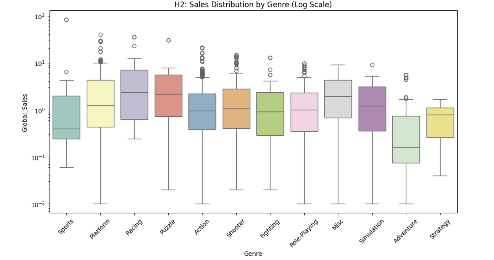
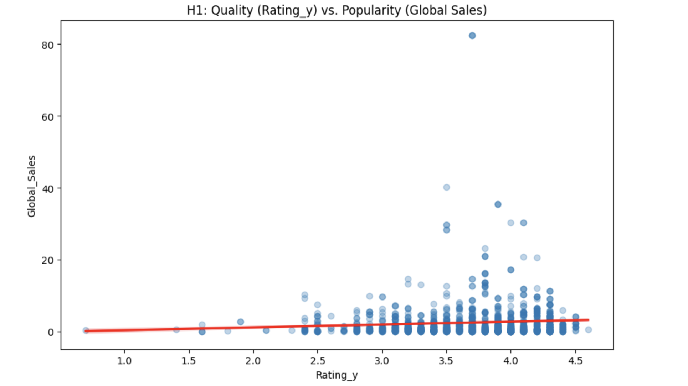
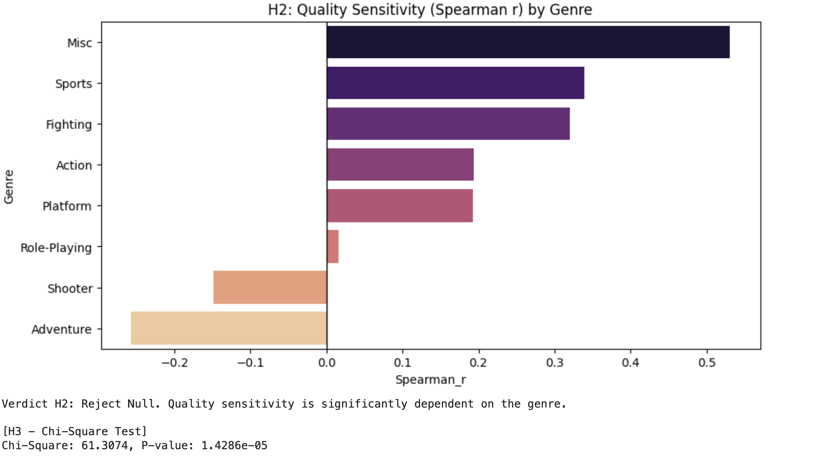
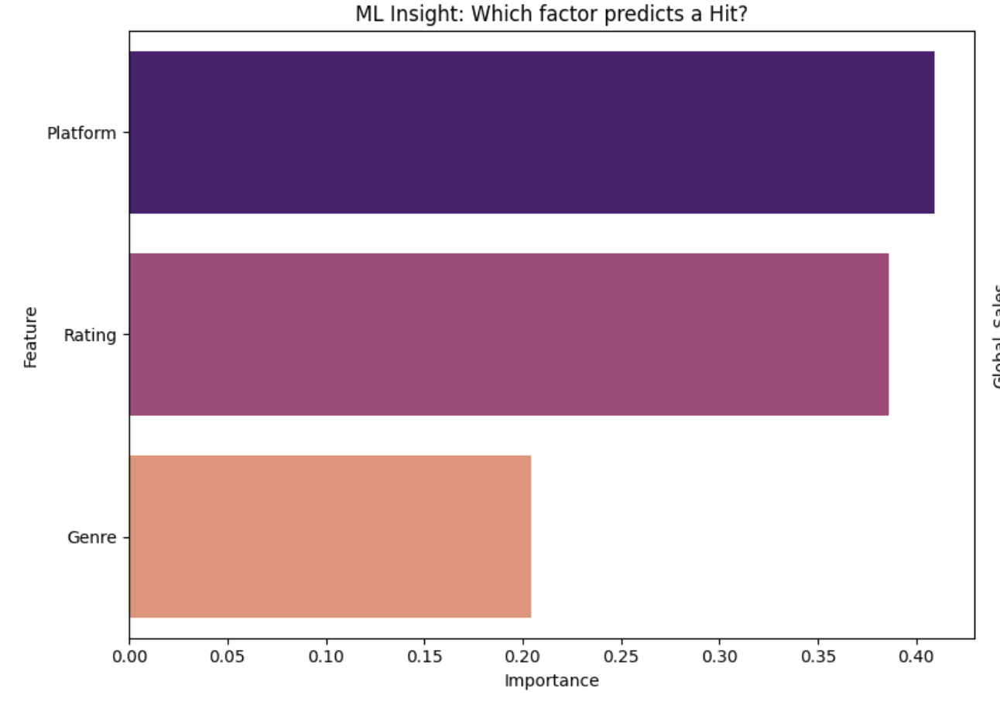
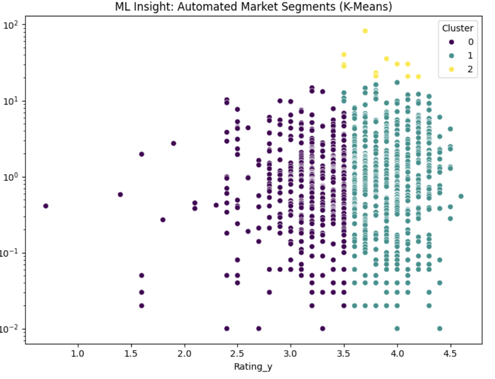

# DSA210 Term Project: Video Game Quality vs. Popularity Analysis
**Student:** Ömer Baran Sına  
**Course:** DSA 210 – Introduction to Data Science  
**Term:** Spring 2025-2026  

---

## 1. Introduction

### 1.1 Motivation
The video game industry has grown into a multi-billion dollar global entertainment market, yet a fundamental question remains heavily debated by consumers and executives alike: **Does a "good" game always sell well?** In an ecosystem saturated with massive marketing campaigns and pre-order cultures, we frequently witness prominent "AAA" blockbusters breaking sales records despite receiving mixed reviews from critics and users. Conversely, critically acclaimed indie masterpieces often struggle to capture mainstream commercial traction. 

This project investigates the **Quality-Popularity Gap**. By analyzing historical sales data alongside critical performance evaluation parameters, this study aims to uncover whether structural market indicators—such as platform exclusivity, distribution channels, and genre trends—exert a greater influence over commercial success than objective product quality.

### 1.2 Objectives
* To aggregate, clean, and integrate historical cross-platform sales figures with modern popularity evaluations across thousands of distinct titles.
* To perform multi-layered statistical testing investigating the global and segment-specific relationship between quality metrics and financial performance.
* To isolate and quantify the occurrences of structural anomalies, specifically defining and mapping market exceptions like "Overhyped" titles and "Hidden Gems."
* To implement predictive and descriptive Machine Learning models evaluating feature priority rules and verifying unsupervised grouping mechanics.

---

## 2. Data & Methodology

### 2.1 Data Sources
The foundational dataset was constructed by executing an inner merge between two comprehensive open-source datasets extracted from Kaggle:
1. **Video Game Sales Data (`vgsales`):** A historical tracking matrix containing global and regional sales breakdowns (North America, Europe, Japan, and Rest of World) for over 16,000 distinct titles distributed across multiple physical hardware eras.
2. **Popular Games & Ratings Data (`games`):** A modern tracking index containing critical evaluations, qualitative user scores, release parameters, and community popularity metrics spanning the years 1980 through 2023.

### 2.2 Data Processing Pipeline
* **Text Standardization and Merging:** Titles in both data matrices were subjected to string processing pipeline routines (`.astype(str).str.lower().str.strip()`) to eliminate formatting mismatches. An inner join operation merged these separate matrices, extracting a clean, unified population sample.
* **Feature Cleaning:** Target rating arrays were dynamically evaluated and coerced into standard numeric floating-point vectors via `pd.to_numeric(errors='coerce')`. Listwise deletion stripped empty records.
* **Categorical Encoding:** To ready text attributes for algorithmic consumption, nominal features including `Genre` and `Platform` were converted to discrete ordinal vectors utilizing `LabelEncoder` pipelines.
* **Target Binarization:** A synthetic operational feature, `Is_Hit`, was generated by evaluating global performance metrics against a hard system median ($y = 1$ if `Global_Sales` > median, else 0).

---

## 3. Exploratory Data Analysis (EDA)

Before running inferential tests, advanced multi-variate EDA pipelines were constructed to visualize patterns within the market's structure.

**Figure 1: Log-transformed distribution of global sales.** After applying the log transformation, the distribution of sales metrics becomes more balanced and easier to interpret, effectively softening the impact of extreme multi-million selling blockbuster outliers.

**Figure 2: Quadrant Analysis of Quality vs. Popularity.** The scatter plot distributes titles into custom financial quadrants. This layout clearly highlights empirical market anomalies such as high-revenue underperformers ("Overhyped") and low-revenue critical masterworks ("Hidden Gems").

---

## 4. Hypothesis Testing

Three separate inferential statistical methodologies were deployed to evaluate the reality of the Quality-Popularity Gap.

### 4.1 H1: The Global Relationship (Parametric Test)
* **Hypothesis:** Higher critical ratings linearly correspond to higher global sales.
* **Result:** **Null Hypothesis Rejected**
* **Statistics:** Pearson $r \approx 0.07$, $p < 0.05$.
* **Conclusion:** While the low $p$-value confirms that a statistically verifiable relationship exists, the extremely low correlation coefficient proves that this link is practically very weak. Quality operates as a poor standalone predictor of global revenue performance.

### 4.2 H2: Quality Sensitivity Across Genres (Non-Parametric Test)
* **Hypothesis:** The strength of the correlation between ratings and sales varies significantly depending on the genre classification.
* **Result:** **Null Hypothesis Rejected**

**Figure 3: Spearman Rank Correlation (r) scores across different game genres.** The bar chart reveals wide operational disparities across distinct classifications. Role-Playing Games (RPGs) demonstrate high quality sensitivity, whereas Sports and Action genres show near-zero sensitivity, meaning their sales are completely decoupled from review scores.

### 4.3 H3: Structural Market Distribution (Independence Test)
* **Hypothesis:** Market positioning outcomes ("Overhyped" vs. "Hidden Gem" status) are significantly dependent upon genre categorization rather than occurring randomly.
* **Result:** **Null Hypothesis Rejected**
* **Statistics:** **Chi-Square Test of Independence** ($p < 0.05$).
* **Conclusion:** The occurrence of atypical commercial performance is a systematic, predictable structural trend within specific market segments, proving that certain genres are inherently more prone to experiencing commercial distortion due to varying marketing budgets and brand power.

---

## 5. Machine Learning Analysis

We applied Machine Learning to move beyond simple correlation and test predictive capability.

### 5.1 Random Forest Classifier
A Random Forest Classifier was trained to predict whether a game becomes a commercial "Hit" based on its Rating, Genre, and Platform parameters. The model achieved an overall **Classification Accuracy of 77%**.

| Target Class | Precision | Recall | F1-Score | Support |
| :--- | :---: | :---: | :---: | :---: |
| **0 (Not a Hit)** | 0.76 | 0.77 | 0.76 | 139 |
| **1 (Commercial Hit)** | 0.77 | 0.76 | 0.77 | 143 |
| **Accuracy** | | | **0.77** | **282** |
| **Macro Average** | 0.77 | 0.77 | 0.77 | 282 |
| **Weighted Average** | 0.77 | 0.77 | 0.77 | 282 |

**Figure 4: Confusion Matrix for the Random Forest Classifier.** The matrix visualizes the balance between correctly identified hits/non-hits and cross-class classification errors made by the model.

**Figure 5: Feature Importance Scores from Random Forest.** The algorithmic priority calculations identify Platform as the most dominant predictor for predicting success, significantly outweighing the actual Quality Rating. This confirms that platform distribution channels and hardware ecosystems carry more weight than game quality.

### 5.2 K-Means Clustering
To remove human bias from the quadrant boundaries, an unsupervised K-Means Clustering routine was deployed across the dimensions of `Rating` and `Global_Sales` with an optimized cluster size of $k=3$.

**Figure 6: K-Means Clustering spatial visualization.** The algorithm automatically maps data into three clean segments: "The Market Baseline" (standard average performers), "The Blockbuster Dynamic" (high sales, completely independent of rating), and "The Cult Classic Archetype" (high ratings, low sales). This unsupervised separation directly validates the structural exceptions proposed in Hypothesis 3.

---

## 6. Limitations & Future Work
* **Temporal Imbalances:** The dataset relies heavily on physical retail transactions across past hardware generations. Integrating contemporary digital platform metrics (e.g., Steam concurrent player counts) would modernize the environment.
* **Omission of Capital Variables:** The data currently lacks direct tracking metrics for marketing budgets. Future iterations should integrate promotional budget approximations to isolate brand equity effects from organic word-of-mouth discovery.

---

## 7. AI Usage Disclaimer
AI tools (Gemini) were integrated throughout the project lifecycle to support code architecture optimization (Pandas merge debugging, label encoding pipelines) and documentation synthesis (formatting statistical tables and clear output reporting). All calculations, hypotheses, and conclusions were manually verified and finalized.

---

## 8. References & Tools
* **Data Environments:** Kaggle Video Game Sales Index, Kaggle Popular Games Repository (1980-2023).
* **Core Packages Used:** `pandas`, `numpy`, `matplotlib`, `seaborn`, `scikit-learn`, `scipy.stats`.
